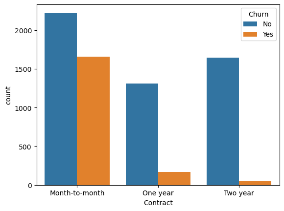
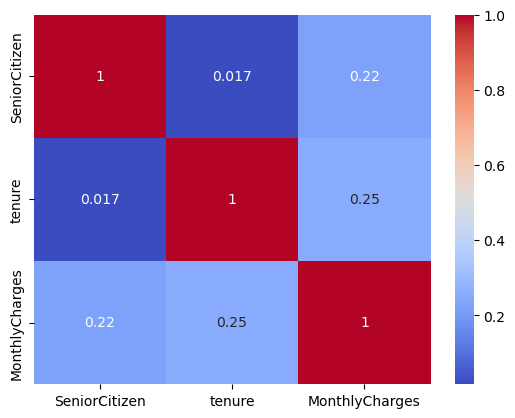

# 🌳 RandomForest - Customer Churn Prediction  

This project demonstrates how to use the **Random Forest algorithm** to predict **customer churn** in a telecom dataset. The aim is to identify customers likely to leave the service based on their attributes and usage patterns.  

## 📊 Problem Statement  

A telecom provider wants to predict **customer churn** (whether a customer leaves the service). Using attributes like **Monthly Charges, Tenure, Support Calls, and Contract Type**, we train a Random Forest model to classify churn:  

- **Target Variable:** `Churn` (0 = No, 1 = Yes)  
- **Features Used:**  
  - `MonthlyCharges`  
  - `Tenure`  
  - `SupportCalls`  
  - `Contract`  

**Dataset:** [Telco Customer Churn - Kaggle](https://www.kaggle.com/datasets/blastchar/telco-customer-churn)  

---

## 🚀 Features  

- Perform **EDA** (Exploratory Data Analysis)  
- **Encode categorical variables** (Contract, Churn)  
- Train and evaluate a **Random Forest Classifier**  
- Visualize **feature importance**  
- Make predictions for new customers  

---

## 📂 Project Workflow  

1. **Data Preprocessing**  
   - Handled categorical encoding  
   - Standardized values where necessary  

2. **Exploratory Data Analysis (EDA)**  
   - Visualized churn distribution  
   - Analyzed tenure, monthly charges, and support calls  

3. **Model Training – Random Forest**  
   - Trained classifier on processed dataset  
   - Evaluated performance with accuracy, precision, recall, F1-score  

4. **Prediction Example**  
   - Input:  
     - `MonthlyCharges = 70`  
     - `Tenure = 8`  
     - `SupportCalls = 4`  
     - `Contract = 'Month-to-month'`  
   - Output: **Predicted Churn = Yes/No**  

---

## 📦 Installation  

```bash
git clone https://github.com/yourusername/RandomForest-Task.git
cd RandomForest-Task
pip install -r requirements.txt
```

---

## 📝 Usage  

```bash
# Run EDA
jupyter notebook perform_eda.ipynb  

# Encode data
jupyter notebook encode.ipynb  

# Train & test Random Forest
jupyter notebook randomforest.ipynb  
```

---

## 📈 Results & Insights  

- **Feature Importance (example order):**  
  1. Contract  
  2. Tenure  
  3. MonthlyCharges  
  4. SupportCalls  

- Customers on **Month-to-Month contracts** are most likely to churn.  
- **Lower tenure** and **higher support calls** correlate with higher churn risk.  

📌 **Conclusion:**  
Random Forest provides a reliable model for churn prediction. By identifying high-risk customers early, the telecom provider can take proactive steps such as loyalty offers, discounts, or better customer support to reduce churn.  

---

## 🖼 Visualizations  

- Churn distribution plot  
- Monthly charges vs churn  
- Tenure vs churn  
- Random Forest feature importance chart  

(Example images to include in repo’s `images/` folder)  

| Churn Distribution | Feature Importance |
|--------------------|---------------------|
|  |  |  

---

## 🤝 Contributing  

Contributions are welcome! Please open issues or submit pull requests.  

---

## 📄 License  

This project is licensed under the MIT License.  
